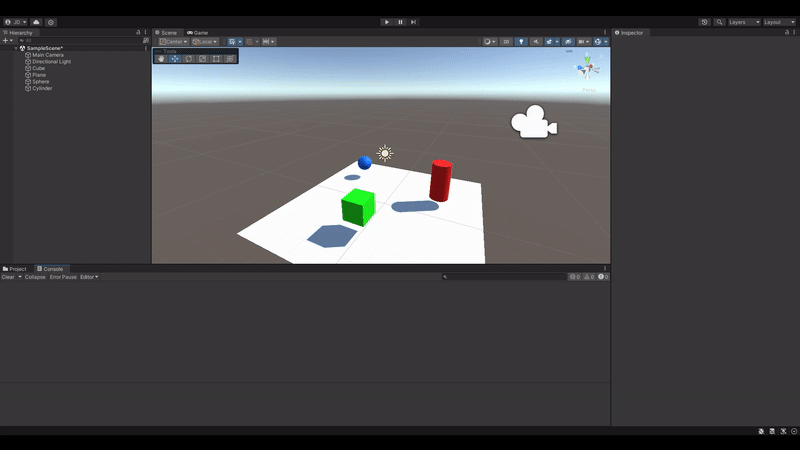

# Interfaces Inteligentes
## Practica 2: Scripts
### RNG

  

  En este Script se definen un par de números (por defecto son 0 y 25) que sirven como límites al nuevo número aleatorio a generar. Si el número generado sobrepasa el valor definido por el usuario (por defecto 15) se mostrará un mensaje por la consola.

  ### Materiales y presentaciones

  

  Antes de crear el Script se nos ha asignado a crear nuevos materiales dentro del inspector de Unity además de introducir nuevos objetos (plano, esfera y cilindro). En mi caso los materiales que he elegido han sido diferentes colores de un material opaco con ligero brillo metálico. 

  El Script en cuestión accederá a la propiedad `name` de cada uno de los objetos y lo mostrará por consola al comenzar la escena.

  ### Vector3 y operaciones

  

  En este Script le añadiremos a la esfera un par de componentes del tipo `Vector3` que utilizaremos para realizar las sigueintes operaciones:

  * La magnitud de cada uno de ellos. 
  * El ángulo que forman
  * La distancia entre ambos.
  * Un mensaje indicando qué vector está a una altura mayor.

  ### Vector posición

  

  En este Script se extraerá la posición de la esfera desde el `transform.position` y se mostrará por consola como un `Vector3`.

  ### Control de distanciamiento social

  

  En este Script la esfera deberá de medir la distancia que existe entre los objeros `cubo` y `cilindro`. Esto lo logra utilizando el método `FindWithTag` para encontrar los objetos con la etiqueta `cubo` y `cilindro` y posteriormente utilizando el método `Vector3.Distance` para calcular la distancia entre ellos.

  ### Alineación

  

  Este Script probocará que los objetos `cubo` y `cilindro` se alineen con la esfera colocándose a su izquierda y derecha respectivamente según el eje X. Para ello hacemos uso de los métodos utilizados en el ejercicio anterior y de `transform.position` para modificar la posición de los objetos.

  ### Cambiar Color

  

  Este Script proporcionará la capacidad de cambiar el color del objeto con la pulsación de una tecla. En concreto se lo colocaremos al objeto `cubo` y con la pulsación de la tecla `A` cambiará su color al seleccionado y el objeto `cilindro` lo hará con la tecla `Up Arrow`.

  ### En Pelotas

  

  Antes de crear el Script se nos ha asignado a crear 5 nuevas esferas, 2 de ellas se encontrarán en un grupo alternativo al que se le ha asignado un color más claro para su diferenciación, así como una etiqueta distinta al resto de esferas.

  El Script deberá encontar la esfera más cercana y la más lejana al cubo, pero solo de las esferas que no se encuentran en el grupo de las esferas alternativas. Para ello se hace uso de `FindGameObjectsWithTag` para encontrar las esferas con la etiqueta `esfera` y posteriormente se utiliza `Vector3.Distance` para calcular la distancia entre ellas y el cubo. Una vez tenemos localizadas cada una de nuestras esferas, debemos hacer que la más cercana aumente su posición `y` y la más lejana cambie su color.

  Lo que he hecho yo en mi Script ha sido parametrizar tanto el cambio de posición como el cambio de color para que sea más fácil de modificar, además de hacer que el cambio de color sea progresivo, cambiando el color RGB a HSV y cambiando la tonalidad por el valor dado por el usuario (por defecto 0.1 (debe ser entre 0 y 1)).
